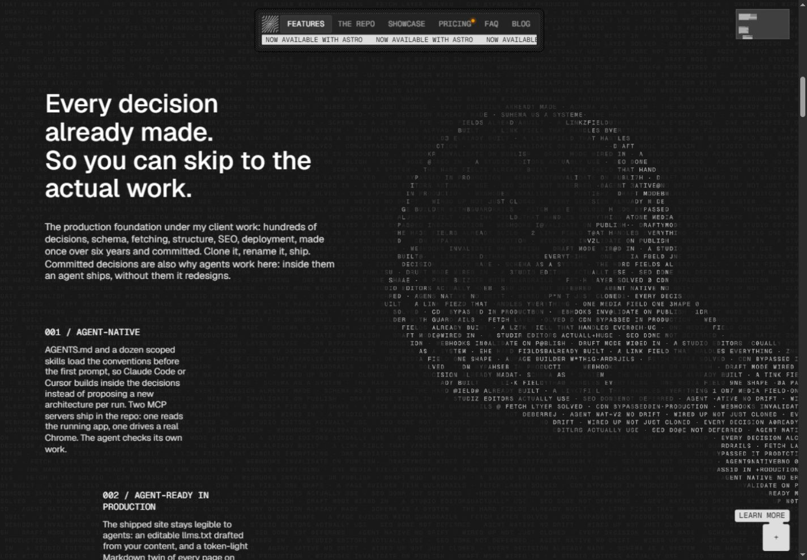
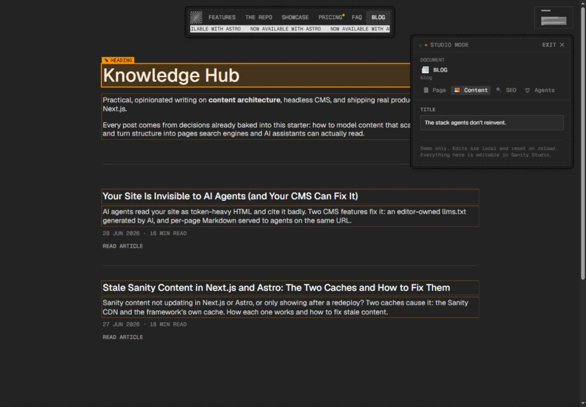
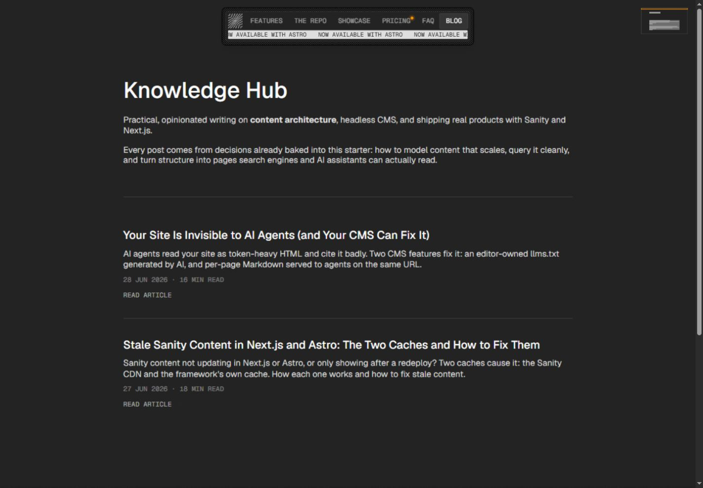

# The Content Architecture 设计拆解

参考：https://www.contentarchitecture.dev/#features
观察日期：2026-09-16。依据本次浏览器观察、页面可见 DOM 和用户提供的标注截图。使用 Product Design audit 流程。

## 风格判断

可概括为：编辑式排版 + 复古终端字符艺术 + 桌面软件工具面板。标题和正文保持现代、清楚；编号、导航、状态信息和图像使用等宽字符；浮动窗口把网站包装成可探索的工作环境。

## 观察步骤与状态

1. 首屏：用户截图及浏览器观察确认左右分屏，暖白文案区与深色环形文字场景对照，层级清晰。
2. Features：已截图。左侧大标题、窄幅正文及阶梯错位的编号说明，右侧字符亮度形成大尺度形体。风格鲜明，但背景需控制对阅读的干扰。
3. Studio：已进入并选择 Heading。橙色框标记可编辑内容，右侧浮窗显示字段；明确提示本地演示、刷新重置。Blog 标题显示 Knowledge Hub，字段却显示首页标题，存在映射不一致；未修改内容。
4. Blog：已导航并截图。单列内容、细分隔线、标题摘要日期组成阅读列表，视觉噪声显著降低。用户后续提供两张过场截图和播放顺序描述：字符先铺满屏幕，再像火烧一样从不同位置消融。可以确认全屏字符覆盖与不规则块状消融两个状态；精确时长、字符刷新频率、运动方向和缓动仍需录像验证。

## 补充：ASCII 字符烧蚀转场

效果可描述为 ASCII noise dissolve / 字符噪声烧蚀转场。这是描述性名称，不代表已确认原站算法或库。

依据用户补充的顺序：当前页面 → 逆向烧蚀，字符从多个位置成片生长、扩张并合拢 → 字符覆盖全屏 → 正向烧蚀，不同位置出现透明孔洞 → 孔洞扩大并连通 → 剩余字符岛消失，露出页面。覆盖阶段也有不规则烧蚀边界，并非瞬间铺满或普通淡入。用户确认的是双向视觉行为，是否使用同一张噪声图严格倒放尚未验证。两张静态截图不能独立确认露出的是旧页面还是新页面，也不能证明字符在持续随机刷新。

视觉关键：等宽字符按规则网格铺排，字符背后有深色块；消融以连片区域发展，边缘仍保留字符格的阶梯感；字符亮度有差异；大尺度有机边界与小尺度方格同时存在。火烧感主要来自孔洞扩张和残留区域收缩，不依赖火焰色或烟雾。

实现建议：用低频连续噪声给每个字符格分配消失阈值，随进度推进移除低于阈值的格子。大尺度噪声控制连片孔洞，少量高频扰动打散边缘，临界格可短暂变亮或替换字符。不要让每格完全独立随机消失，否则更像雪花噪点。使用 Canvas 或 GPU 遮罩均可，尚未确认原站技术。

跨页协调建议：遮罩完全覆盖后切换页面，目标内容准备好再消融揭示；覆盖层同时遮住背景和正文，避免漏出中间状态。动画期间防止重复导航，异常时能够清除遮罩，减少动态效果模式使用短淡入或直接切换。此处为复用方案，不是对原站隐藏行为的断言。

## 实测规格

## 补充：鼠标附近的径向遮挡

用户提供首屏圆环及 Features 的鼠标区域截图，并说明字符在鼠标移动时被遮住。视觉表现为以鼠标附近为中心的大面积深色区域：中心接近不透明背景色，向外逐渐透明，字符从中心不可见过渡到外围正常可见；CLICK / CLICK & HOLD 提示仍可辨识。应描述为软边径向遮罩或反向聚光灯，与跨页字符烧蚀分开。

实现建议而非源码结论：用背景同色的径向渐变覆盖字符层，或者在字符绘制时按到鼠标的距离降低透明度。中心设实心范围，外围使用平滑衰减。跟随位置、进入退出强度、按下状态可以分别插值，防止突然跳变。截图不能区分覆盖层、Canvas 擦除或 shader 遮罩，也不能确定实际半径、延迟、拖尾、恢复时间或按住效果；这些需连续动态证据验证。普通正文和操作按钮不应被此装饰遮罩挡住。

## 桌面样式取样

## 补充：首屏圆环环绕与字符变化

用户另行指出首屏右侧的“圆圈环绕 + 字体变化”。截图显示多层同心文字环，文字沿圆周切线排列，外圈超出容器并被裁切。动态环绕与字符变化由用户观察确认；不能仅据截图判断每圈方向、相对转速、字体家族是否变化、字符变化的具体规则。

动效应分为三个独立层：圆周位置连续变化形成整体环绕；局部字符自身变化形成细节扰动；鼠标附近的软边径向遮罩形成交互反馈。用户进一步确认：圆环转速与鼠标滚轮滚动速度正相关，滚动越快，环绕越快。因此主运动应记录为滚动速度驱动，而非固定速度循环；驱动取自 wheel 输入还是页面实际滚动速度，尚未确认。多圈是否异速或反向须通过原站录像确认，不作为已验证特征。不要直接旋转整张截图，否则会把鼠标遮罩和提示标签一并旋转，也无法独立控制字符变化。

复现建议（非原站已测参数）：目标角速度 = 基础角速度 + 系数 × 滚动速度绝对值，经过平滑与上限控制后积分得到圆环角度。滚动停止时平滑回落；是否回到静止或保留基础旋转尚待观察。向上滚是否反转、响应是否线性、加速和减速持续时间也尚未确认。应使用速度而非累计滚动距离驱动转速，使快速滚动产生加速反馈，同时保留字符错峰变化和鼠标遮罩的独立控制。

## 补充：三处常驻动效的节奏分工

用户进一步澄清，“动画节奏”具体指截图标出的三处，而非鼠标遮罩。以下动态行为来自用户实际观察与描述，静态截图提供位置证据；尚未测量原站速度、周期和触发条件。

1. 导航下方公告条：横幅式横向滚动，重复公告文字构成连续的信息带。复用时建议匀速无缝循环，避免在接缝处跳动；方向与速度以录像为准。
2. Features 字符背景：用户描述为“字体随机切换”。结合画面可描述为字符内容随机替换/扰动，不能据此认定字体家族在切换。复用时保持字符网格及大尺度亮暗形体稳定，让局部字符错峰更新，避免全屏同步闪烁。
3. 右上角小地图 / Studio 入口：橙色高亮由上向下扫过，用户称其为修改提示。视觉上可称橙色扫描带；尚未确认它代表真实修改状态，或是吸引用户进入编辑模式的循环提示。复用时建议短暂扫描、完成后留出静止间隔，仅在真实发生修改时才使用“已修改”语义。

三者的设计节奏可归纳为：公告条连续平移，背景字符局部跳变，橙色提示方向性扫描。它们通过不同运动方式与显著程度建立层次。上述关于无缝、错峰和静止间隔的内容为设计建议，不是已测得的原站参数。

1440×1000 视口：body 背景 rgb(241,238,231)，即 #F1EEE7；首屏标题文字 rgb(35,35,35)，即 #232323。
Features h2 为 GeistSans，约 45.91px / 50.50px，weight 500。
Features h3 为 GeistMono，约 15.74px / 19.67px，weight 400。
Features 正文为 GeistSans，约 15.74px / 19.67px，weight 400。
上述为当前视口计算值，不是完整响应式 token。

## 可复用的设计规则

- 颜色：暖白、炭黑、灰白为主；橙色只用于状态和选中反馈。
- 字体分工：无衬线负责阅读，等宽字体负责编号、标签和工具感。
- 构图：首屏左右对照；功能区文字与图形不对称；文章区收窄为单列。
- 材质：细边框、颗粒/网点边缘、小幅圆角与浅阴影用于工具窗口；不要给每段正文都套卡片。
- 字符画：让文字承担纹理、轮廓、明暗与空间，保持主文案所在区域低干扰。
- 交互：导航、编辑、内容选择都有明确状态；产品演示让用户直接操作，降低理解成本。
- 移动端：已观察到窄屏导航折叠、功能正文单列；没有完成所有断点及触屏测试。

## 实现建议（不是原站源码结论）

字符场景可用 Canvas 2D 字符网格配合亮度场生成，大尺度变化再考虑 WebGL。正文、按钮和链接保留正常 HTML。装饰层忽略辅助技术与指针事件，必要交互另设明确入口。
Studio 演示可拆成内容数据、元素到字段映射、选中状态、属性面板、本地临时修改；真正 CMS 编辑还需要鉴权、草稿、发布与历史版本。
跨页转场采用上文字符覆盖与噪声消融方案；后续用原站录像校准时序与缓动。静态帧显示字符覆盖可以达到全屏，不能假设导航始终处于遮罩上方。减少动态效果偏好开启时跳过强转场。
如果用于工作台，保留工具栏、状态色、等宽编号、属性面板；把高密度字符动效主要放在首页、空状态或展示区。

## 风险与限制

Studio 入口可发现性弱；密集字符纹理可能影响长文阅读；窄屏曾出现订阅浮层遮住功能内容；Blog 演示字段存在与选中文字不一致的现象。无完整键盘、读屏、性能及动态减弱测试，不作无障碍合规结论。

## 截图

